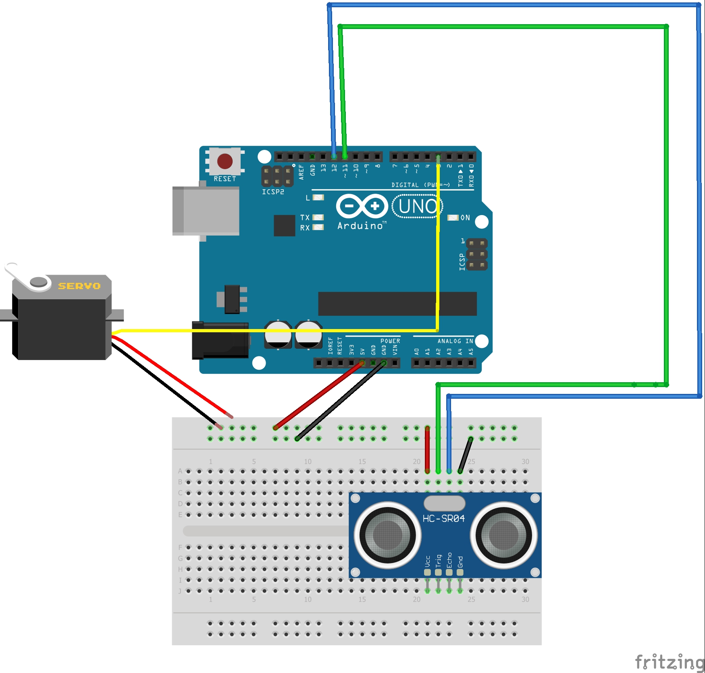

# Arduino
My Arduino assignments:

# Hello_Functions

### Description

Hello Functions is an assignment that uses functions to make a servo move in a direction based on the values given by an ultrasonic sensor.
### What I learned
* I learned that functions allow you to use large bits of codes multiple times easily
* I learned that the Arduino has helpful articles about bits of code

### Wiring Diagram

# NewPing 

### Description

NewPing is an assignment that uses the NewPing library to recieve a millisecond value when a button is pressed by using solar.ping().

### What I learned
* I learned how to use the New Ping library
* I learned that the internet has helpful explanations about code

### Wiring Diagram

